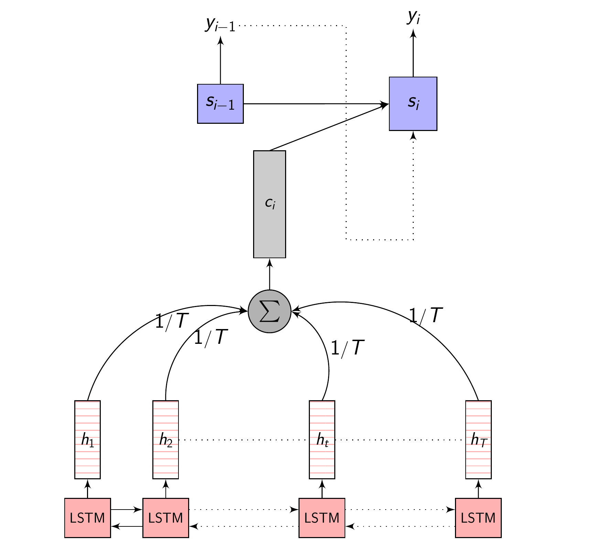
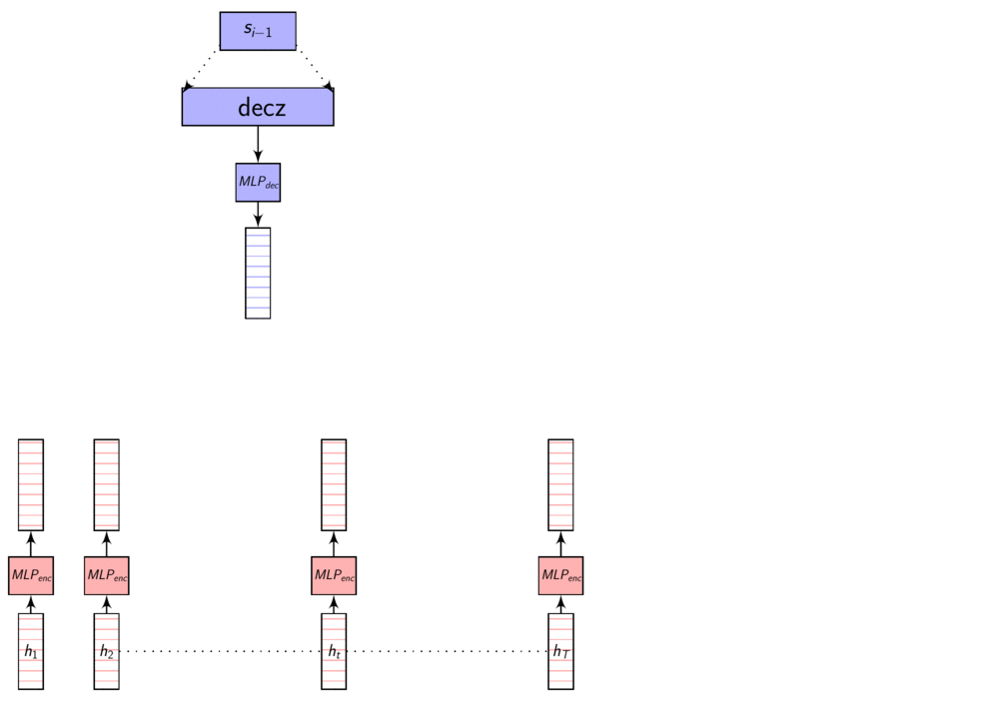
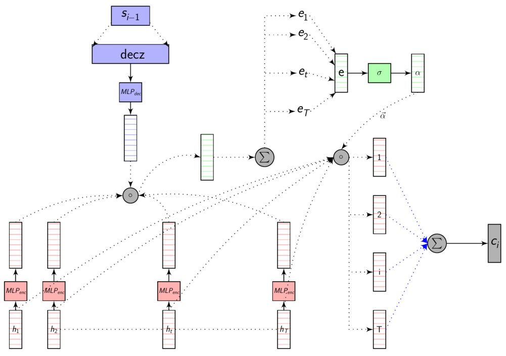
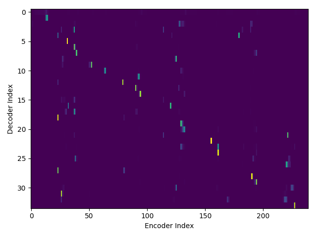
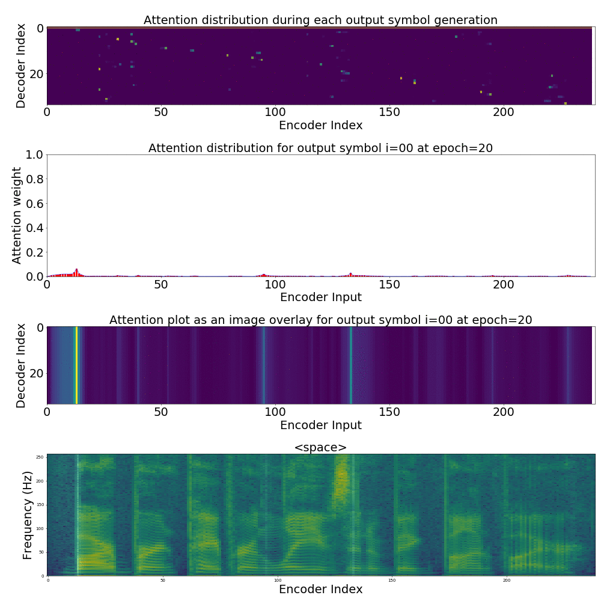

# Attention models in ESPnet toolkit for Speech Recognition

TL;DR - Different attention mechanisms available in the ESPnet toolkit explained. Have a look at the presentation that I gave in IIIT-B AI reading group (no math included) [Attention based models in End-to-End ASR](https://github.com/sknadig/attention_presentation/raw/master/Final.pdf)


I'll directly jump to explaining the different Attention models available in the [ESPnet](https://github.com/espnet/espnet) toolkit.
(I won't be going into the implementation challenges in getting the Encoder-Decoer Attention models work.)

Please have a look at the [previous post]() for the basics of Attention models in Speech recognition. This post assumes you know the Attention mechanism in general and build from there.

- No Attention
- Content-based Attention
  - Dot product Attention
  - Additive Attention
- Location-aware Attention
  - Location Aware Attention
  - 2D Location Aware Attention
  - Location Aware Recurrent Attention
- Hybrid Attention
  - Coverage Mechanism Attention
  - Coverage Mechanism Location Aware Attention
- Multi-Head Attention
  - Multi-Head dot product Attention
  - Multi-Head additive Attention
  - Multi-Head Location Aware Attention
  - Multi-Head Multi-Resolution Location Aware Attention

## Attention - Recap

- $x = (x_{1}, x_{2}, .........., x_{T})$ - is the input sequence
- $y = (y_{1}, y_{2}, .........., y_{U})$ - is the target output sequence
- $h = (h_{1}, h_{2}, .........., h_{T})$ - is the output of the Encoder
- $h_{t} = f(x_{t}, h_{t-1})$ - is the Encoder function
- $C_{i} = \sum_{j=1}^{T} \alpha_{i,j} \cdot h_{j}$ - is the Context vector
- $\alpha_{i,j} = Softmax(e_{i,j}) = \frac{e^{e_{i,j}}}{\sum_{k=1}^{T} e^{e_{i,k}}}$ - are the Attention weights
- $e_{i,j} = a(s_{i-1}, h_j)$ - is the importance parameter for every encoded input
- $\sum_{j=1}^{T} e_{i,j} \neq 1$ - the importance parameter need not sum to 1
- $\sum_{j=1}^{T} \alpha_{i,j} = 1$ - the attention weights sum to 1

## Types of Attention

Broadly, attention mechanisms can be categorized into 3 distinct categories

- Content aware Attention
- Location aware Attention
- Hybrid Attention

Multi-Head Attention mechanisms are a different beast altogether, we will cross that bridge when we get there. For now, let's concentrate on the 3 broad categories I mentioned.

### No Attention (Equal Attention?)

Here, no attention is used at all. Each of the $h_{i}$ are given equal importance and linearly mixed and averaged to get $C_{i}$

$$e_{t} = \frac{1}{T}$$

$$C_{i} = \sum_{j=1}^{T} \frac{1}{T} h_{j}$$

#### [No attention - code](https://github.com/sknadig/espnet/blob/12d2b8181f6e7b1c9f81b002f6096840e928adbf/espnet/nets/pytorch_backend/attentions.py#L11)

``` py
#Mask = Ones where enc_h is present. Zeros where padding is needed.
mask = 1. - make_pad_mask(enc_hs_len).float()
att_prev = mask / mask.new(enc_hs_len).unsqueeze(-1)
att_prev = att_prev.to(enc_h)
c = torch.sum(enc_h * att_prev.view(batch, h_length, 1), dim=1)
```

#### No attention - full picture

<center>

</center>

### Content-based Attention

Content-based Attention - as the name suggests is based on the contents of the vector $s_{i-1}$ (Decoder hidden state) and $h_{t}$ (Annotation vectors from the Encoder). This means, our **compatibility function** or the Attention function depends only on the contents of these vectors, irrespective of their location in the sequence.

What does this mean?
Let's say what has been spoken in the utterance is **Barb burned paper and leaves in a big bonfire.** with the phonetic sequence as **sil b aa r sil b er n sil p ey sil p er n l iy v z ih n ah sil b ih sil b aa n f ay er sil**. The feature vector of a phoneme, let's say **b** will be **similar** no matter the location of the phoneme in the sequence _sil **b** aa r sil **b** er n sil p ey sil p er n l iy v z ih n ah sil **b** ih sil **b** aa n f ay er sil_

This would give equal weight to the same phoneme, but from a different word which is not relevant to the current context. Also, a **phonetically similar** phoneme will get a close score to the actual phoneme.

Content-based Attention is computed as:

$$
\begin{equation}
  e_{i,j} = a(h_{j}, s_{i-1})
\end{equation}
$$

Dot product and additive attention are content-based attention mechanisms.

#### 2. Dot product Attention

In the dot product attention, our similarity measure is the dot product between the vector $s_{i-1}$ and $h_{t}$. For generating the Context vector $C_{i}$, we take the Decoder hidden state $s_{i-1}$ when generating the previous output symbol $y_{i-1}$ and compute the dot product with each $h_{t}$ to get $e_{i,j}$ for each of the Annotation vectors.

Conceptually dot product signifies how similar each vectors are (the angle between them). More similar they are, higher the value.

Here's an image explaining Dot Product Attention

Here, **dec_z** vector is the Decoder hidden state.

<center>

</center>

As we discussed in the [previous post](http://sknadig.dev/basics-attention/#before-we-start-with-the-different-attention-models), these representations are in different dimensions. So, we learn a transformation to transform them to same dimensions so that we can compare them using dot product or addition.
This transformation is learnt with other parameters using backprop.

#### [Dot product attention - code](https://github.com/sknadig/espnet/blob/12d2b8181f6e7b1c9f81b002f6096840e928adbf/espnet/nets/pytorch_backend/attentions.py#L57)

``` py
mlp_enc = torch.nn.Linear(eprojs, att_dim)
mlp_dec = torch.nn.Linear(dunits, att_dim)

pre_compute_enc_h = torch.tanh(mlp_enc(enc_h))
e = torch.sum(pre_compute_enc_h * torch.tanh(mlp_dec(dec_z)).view(batch, 1, att_dim),
    dim=2)

w = F.softmax(scaling * e, dim=1)
c = torch.sum(enc_h * w.view(batch, h_length, 1), dim=1)
```

#### Dot product attention - full picture

<center>

</center>

If we are computing the attention weights based on only the contents of the vectors from Decoder and Encoder, similar Annotation vectors get weighed equally irrespective of the position.
We can see this clearly from the Attention plots from the model. Observe in the following image how the Attention weights are not monotonic and tend to be distributed near positions where the Annotation vectors are similar in the acoustic space.

<center>

</center>

We could also plot where the model is attending to for generating each output symbol. Here, I have added an overlay for each row of the first image just to highlight which output symbol is being generated. The actual attention weights look like the above image.

We could also correlate this with the spectrogram of the utterance, since we know how much sub-sampling was done in the model. I have used a sub-sampling of **1_2_2_1_1**. In our utterance FJSJ0_SX404, if we use a window size of 250ms and a frame shift of 10ms, we get 240 frames of feature vectors. Because of sub-sampling in our model, these features are mapped to 60 feature vectors after the Encoder network.

<center>

</center>
