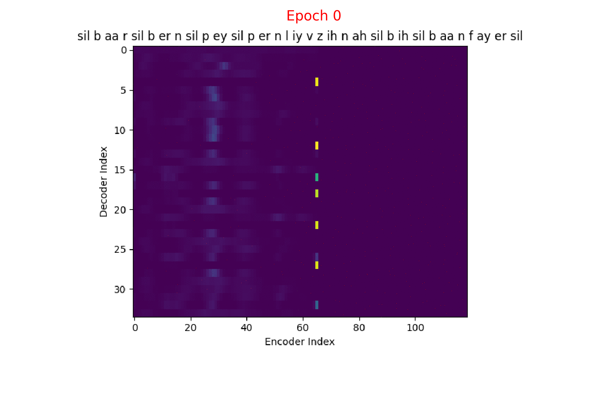
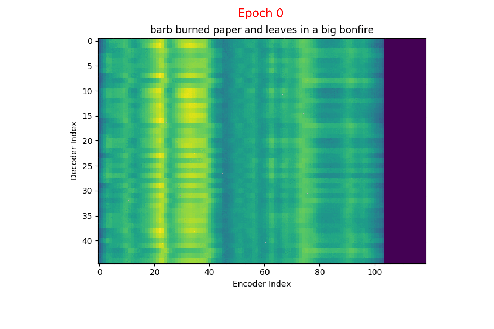

# Introduction to attention models for speech recognition

In the [previous post]() we discussed the Encoder-Decoder framework for Speech Recognition.

**So, why do we need Attention? What's wrong with the Encoder-Decoder framework?**

As we discussed in the Encoder-Decoder framework:

- $x = (x_{1}, x_{2}, .........., x_{T})$ be a length $T$ input feature vector sequence to the Encoder network.

- $y = (y_{1}, y_{2}, .........., y_{U})$ be a length $U$ output symbol sequence the Decoder (also called the Generator) network generates.

- $h = (h_{1}, h_{2}, .........., h_{T})$ be the Encoder network output which is the encoded hidden vector sequence of length $T$.

- Each encoded representation (annotation) $h_{t}$ contains information about the input sequence with **focus** on the $t^{th}$ input of the sequence.

In the Encoder-Decoder framework, the Encoder **tries** to summarize the entire input sequence in a fixed dimension vector $h_{t}$.

    

## Potential issues with Encoder-Decoder

- The neural network needs to be able to **compress** all the necessary information of the input feature vector sequence into a fixed dimension vector
- When the sequence is long, especially when the input sequence at test time is significantly longer than the training ones, the performance of the basic Encoder-Decoder network degrades.
- Also, it is my opinion that forcing the Encoder to summarize the entire feature vector sequence into a fixed dimension vector depends on the size of the vector (longer the sentence - longer the vector) which we can't fix as the sequence length can vary significantly.

## Attention!

One of the solutions to this problem that people have been proposing is the use of Attention. Basically, Attention is an extension to the Encoder-Decoder framework.

> Each time the model needs to generate an output symbol, it (soft-) **searches for a set of positions** in the input feature vector sequence where the most **relevant** information is concentrated.
> {: .notice--info}

We are now concerned with making the model select these **set of positions** in the input sequence **accurately**.

The main difference with the Encoder-Decoder framework is that here we are not trying to summarize the entire input sequence into a fixed dimension vector.

We know from the Encoder-Decoder post that the Encoder is a Recurrent neural network (RNN/LSTM/BLSTM/GRU) and $h_{t}$ is the Encoder hidden state at time $t$ which is computed as:

$$
    \begin{equation}
    h_{t} = f(x_{t}, h_{t-1})
    \end{equation}
$$

Now, instead of feeding the hidden representation $h_{T}$, let us select a subset of $h$ which are most relevant to a particular context to help the Decoder network generate the output.

We linearly blend these relevant $h_{t}$ to get what we refer to as the **Context vector $C_{i}$**

$$
\begin{equation}
  C_{i} = q(\{h_{1}, h_{2}, .........., h_{T}\}, \alpha_{i})
\end{equation}
$$

**Attention:** In a way, the model is **attending** to a subset of the input features which are most relevant to the current context.

In all the deep learning techniques, we would like the functions to be differentiable so that we can learn them using backprop. To make this technique of attention to a subset differentiable, we **attend to all the input feature vectors, but with different weight!**

## Differences with the Encoder-Decoder network

- In the Encoder-Decoder network that we discussed in the previous post, the Decoder hidden state is computed as:

  $$
    \begin{equation}
    s_{i} = f(s_{i-1}, y_{i-1})
    \end{equation}
  $$

- In the Attention extension, we take the Context vector in computing the Decoder hidden state:

  $$
      \begin{equation}
      s_{i} = f(s_{i-1}, y_{i-1}, C_{i})
      \end{equation}
  $$

- The Context vector is the summary of only the most relevant input feature vectors. To capture this _relevance_, let's consider a variable $\alpha$ where $\alpha_{i}$ represents the weight of the encoded representation (also referred to as the **annotation**) $h_{i}$ in the Context vector $C_{i}$ - for predicting the output at time $i$. Given this $\alpha$, we can compute the Context vector as:

  $$
  \begin{equation}
    C_{i} = \sum_{j=1}^{T} \alpha_{i,j} \cdot h_{j}
  \end{equation}
  $$

$$
 \begin{equation}
   \sum_{j=1}^{T} \alpha_{i,j} = 1
 \end{equation}
$$

- To compute $\alpha_{i,j}$, we need $e_{i,j}$ - the importance of the $j^{th}$ annotation vector for predicting the $i^{th}$ output symbol. This is what the **compatibility function** produces.

  The weight $\alpha_{i,j}$ of each annotation $h_{j}$ is computed as:

  $$
  \begin{equation}
    \alpha_{i,j} = Softmax(e_{i,j}) = \frac{e^{e_{i,j}}}{\sum_{k=1}^{T} e^{e_{i,k}}}
  \end{equation}
  $$

  $$
  \begin{equation}
    \sum_{j=1}^{T} e_{i,j} \neq 1
  \end{equation}
  $$

- Where $e_{i,j} = a(s_{i-1}, h_j)$, **$a$** is a **compatibility function** which computes the importance of each annotation $h_j$ with the Decoder hidden state $s_{i-1}$.

> In all our Attention models, it is this **function _$a()$_** that is going to be different.   _$a()$_ defines what type of Attention it is.
> {: .notice--info}

- This image summarizes the Attention mechanism. Observe each annotation vector is scaled by the attention weight $\alpha_{i,j}$

- In the Encoder-Decoder network - Given the Decoder hidden representation $s_{i-1}$ (from the previous output time) and the output symbol $y_{i-1}$ (the previous output symbol), we can predict the output symbol at the current time step as:

  $$
  \begin{equation}
  p(y_{i} | \{y_1, y_2, .........., y_{i-1}\}) = g(y_{i-1}, s_i)
  \end{equation}
  $$

  Where $g()$ is the entire Decoder function.

- In the Attention extension - Given the Context vector $C_{i}$, the Decoder hidden representation $s_{i-1}$ (from the previous output time) and the output symbol $y_{i-1}$ (the previous output symbol), we can predict the output symbol at the current time step as:

  $$
  \begin{equation}
  p(y_{i} | \{y_1, y_2, .........., y_{i-1}\}, C_{i}) = g(y_{i-1}, s_i, C_{i})
  \end{equation}
  $$

  Where $g()$ is the entire Decoder function.

- The probability of the full output sequence $y$ can be computed as:

  $$
  \begin{equation}
  p(y) = \prod_{i=1}^{U} p(y_i | \{y_1, y_2, .........., y_{i-1}\}, C_{i})
  \end{equation}
  $$

## Attention weights visualization

So, what does Attention even look like?

I trained an Attention model on the TIMIT dataset using the ESPnet toolkit and visualized the weights for 20 epochs and this is what it looks like for the speaker FJSJ0 and utterance SX404 of TIMIT:

> Word transcript for FJSJ0_SX404 : **Barb burned paper and leaves in a big bonfire.**
> {: .notice--info}

> Phoneme transcript for FJSJ0_SX404 : **sil b aa r sil b er n sil p ey sil p er n l iy v z ih n ah sil b ih sil b aa n f ay er sil**
> {: .notice--info}

### Phoneme decoding - final weights

### Character decoding - final weights

On the $x$ axis from left to right is the Encoder index ranging from $0$ to $T$, where $T$ is the length of the input feature vector sequence. On the $y$ axis from top to bottom is the Decoder index ranging from $0$ to $U$, where $U$ is the length of the output symbol sequence.

Here, you can see that each row corresponds to the weight for each input feature vector $h_{t}$ in producing the Context vector $C_{i}$ for generating the output symbol $y_{i}$.

If you see the Attention weights before the model is trained (at epoch 0), the Attention weights are all random and hence the Context vector $C_{i}$ contains unnecessary noise from irrelevant input feature vectors. This leads to a degraded performance of the model. It is fairly evident that a good Attention model produces a better Context vector which leads to better model performance.

### Phoneme decoding - initial weights

### Character decoding - initial weights

### Attention weights for single output symbol

I'm working on visualizing the Attention weights over a Spectrogram every time an output symbol is generated. Ideally it should look like a Gaussian distribution with it's mean at the most relevant $h_{t}$ for generating $y_{i}$ and it's variance proportional to the duration of the phoneme utterance. This is proving more involved than I initially thought, requiring changes to the ESPnet code at a deeper level. I will update this post when I have that.

**Update:**

If we plot the Attention weights over the annotation sequence $h_{t}$ for generating each $y_{i}$, we could see how Attention is playing a role in producing the Context vector $C_{i}$.

Here's what the Attention weights look like for generating each $y_{i}$ at epoch 1.

Here's what the Attention weights look like for generating each $y_{i}$ at epoch 20.

We could also see how Attention weights progress over time (epochs) to get deeper understanding of how the model is learning. I did just that combining all the Attention weights from each epoch into a gif. Here's what it looks like:

### Phoneme decoding - Attention weights over epochs

### Character decoding - Attention weights over epochs

## Before we start with the different Attention models

In all the subsequent discussions of Attention models, I would like to follow _some_ consistency. For example, anything that is orange in color is related to the Encoder side of the network, blue with Decoder side and green with the Attention function itself.

We will see often that the representation (annotation) learnt by the Encoder, the hidden state of the Decoder and the representations learnt by the Attention function are of different dimensions. This means we can't add them or take dot product.

$$
\begin{equation}
  dim(h_{t}) \ne dim(s_{i}) \ne dim(f(e))
\end{equation}
$$

To overcome this issue, we project each of these vectors to a fixed dimension and this **non-linear projection** is learnt along with the other parameters of the network.

In the [next post]() we will discuss about the different Attention models available in the [ESPnet](https://github.com/espnet/espnet) toolkit.
