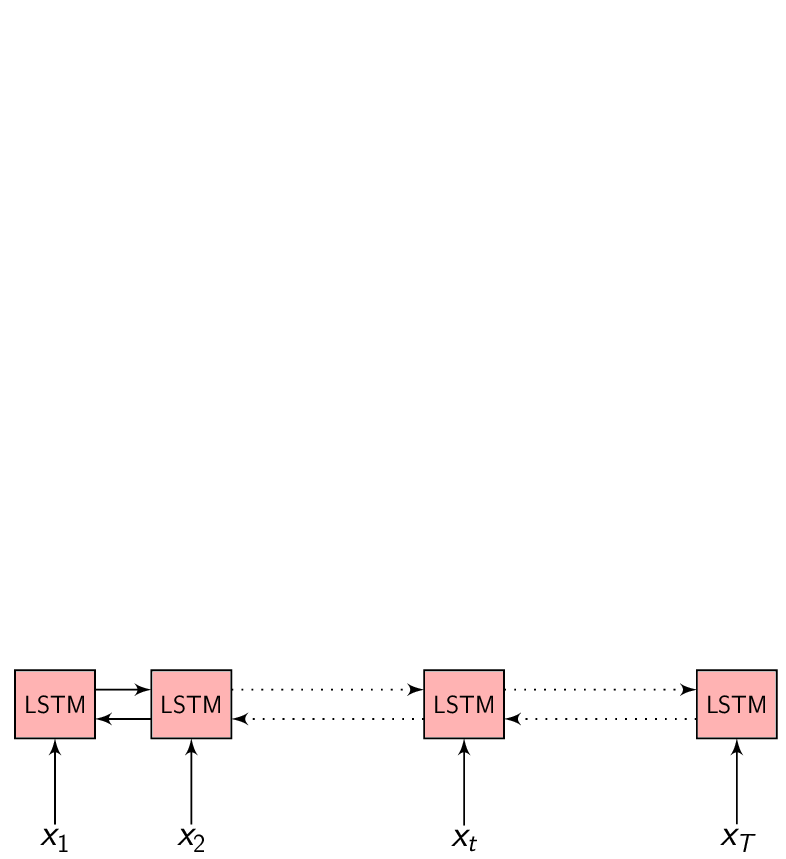
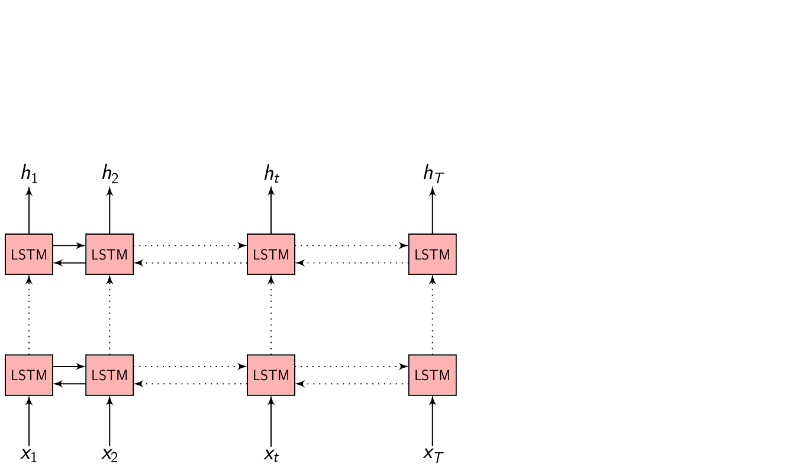

# Encoder-Decoder framework for Speech Recognition

In most of the problems we are trying to solve with Machine Learning/Deep Learning, we have a set of inputs $x = (x_{1}, x_{2}, .........., x_{T})$ that we would like to map to a set of outputs $y = (y_{1}, y_{2}, .........., y_{T})$. Mostly, each input $x_{i}$ corresponds to an output $y_{i}$.

We assume there is some function $f()$ that can map all of these $x{i}$ to their corresponding $y_{i}$

$$
\begin{equation}
  y_{i} = f(x_{i}, \theta)
\end{equation}
$$

When we have this data (x-y pairing), a Supervised learning algorithm can be used to train a model to approximate this mapping function $f()$.
And it has been many people's mission to build algorithms to approximate this function $f()$ as accurately as possible.

## Problem of Speech

The problem with Speech is, our feature vectors are taken from a [short time spectra](http://practicalcryptography.com/miscellaneous/machine-learning/guide-mel-frequency-cepstral-coefficients-mfccs/) of speech signal. Which means we have a feature vector for every 20-25ms or so.

So, what is the problem?

The problem is, **first** : we don't know where the boundary is between one sound (phoneme) and another. If you could open a speech signal in any [signal processing software](https://www.audacityteam.org/) and cut the signal to ~200-300ms and listened to it without any context, it is not possible to distinguish which sound it is.

> **Context** matters!
> {: .notice--info}

**Second** : Intra- and inter-speaker variability - the way one person pronounces a word is different than another person. There are many reasons for this, they may speak different primary language (L1 effect on L2), their vocal tract characteristics are different, gender, age, etc. everything plays a role in how we pronounce words.

**Third** : the problem with the language itself. If we take English for example. **phonemes** is pronounced as **ˈfōnēm**. Where is the sound **f** represented in the word phoneme?.

(There are other practical issues that are not relevant to this discussion)

That being said, let's consider **only the first problem for now**, where we don't know what sound it is when given an isolated chunk of 100-300ms speech signal. When we collect data to train a model to do Speech recognition, we might give people a previously decided transcript and ask them to read it, then record their speech to get speech data. Or we might collect already existing speech-text pair of data (Audiobooks, Broadcast news recording etc.) to train our model.
Observe, in either case, the data we have is the speech signal and the corresponding transcript at the **word level**. That is, we do not have data about where a word (or a phoneme) ends and where another begins.

**How do we train a model when we don't even know the $x - y$ pair?**

This challenging problem of **sequence modeling** has been the interest of speech community since many decades. There have been many approaches to tackle this problem, two of the recent ones are: [**Connectionist temporal classification**](https://distill.pub/2017/ctc/) and the [**Encoder-Decoder**](https://papers.nips.cc/paper/5346-sequence-to-sequence-learning-with-neural-networks.pdf) approach.

## Encoder-Decoder network

- $x = (x_{1}, x_{2}, .........., x_{T})$ be a length $T$ input feature vector sequence to the Encoder network.

- $y = (y_{1}, y_{2}, .........., y_{U})$ be a length $U$ output symbol sequence the Decoder (also called the Generator) network generates.

- $h = (h_{1}, h_{2}, .........., h_{T})$ be the Encoder network output which is the encoded hidden vector sequence of length $T$.

    

- Each encoded representation $h_{t}$ contains information about the input sequence with **focus** on the $t^{th}$ input of the sequence.

- $$
    \begin{equation}
    h_{t} = f(x_{t}, h_{t-1})
    \end{equation}
  $$

  is the hidden state at time $t$, where $f()$ is some function the Encoder is implementing to update it's hidden representation.

In the Encoder-Decoder framework, the Encoder tries to **summarize** the entire input sequence in a fixed dimension vector $h_{t}$. The Encoder itself is a Recurrent neural network (RNN/LSTM/BLSTM/GRU) which takes each input feature vector $x_{t}$ and switches it's internal state to represent (summarize) the sequence till that time inside $h_{t}$.

We could take $h_{t}$ at every time step to make a prediction (or not), but we shall wait till the end of the sequence at time $T$ and take the representation $h_{T}$ to start generating our output sequence. This is because we don't know the word/phoneme boundaries and we are **hoping** the Encoder is _able_ to summarize the input sequence entirely inside $h_{T}$.

We give as input a **\<sos\>** - start of the sequence token to the Decoder for consistency and to start generating output symbols. The Decoder is another Recurrent neural network (not bidirectional) which switches it's internal state every time to predict the output.

At every time step, we feed the output from the previous time step to predict the current output.

$$
    \begin{equation}
    s_{i} = f(s_{i-1}, y_{i-1})
    \end{equation}
$$

is the Decoder hidden state when predicting $i^{th}$ output symbol, where $f()$ is some function the Decoder LSTM is implementing to update it's hidden representation.

Given the Decoder hidden representation $s_{i-1}$ (from the previous output time) and the output symbol $y_{i-1}$ (the previous output symbol), we can predict the output symbol at the current time step as:

$$
\begin{equation}
p(y_{i} | \{y_1, y_2, .........., y_{i-1}\}) = g(y_{i-1}, s_i)
\end{equation}
$$

Where $g()$ is the entire Decoder function.

The probability of the full output sequence $y$ can be computed as:

$$
\begin{equation}
p(y) = \prod_{i=1}^{U} p(y_i | \{y_1, y_2, .........., y_{i-1}\}, s_{i})
\end{equation}
$$

We will stop generating the output symbol sequence when the Decoder generates an **\<eos\>** - end of sequence token.

    

## Summary

- $x = (x_{1}, x_{2}, .........., x_{T})$ is the input sequence
- Encoder: Summarizes the entire input sequence $x$ inside $h_{T}$
- $h = (h_{1}, h_{2}, .........., h_{T})$ is the hidden vector sequence
- $h_{t}$: Summary of the input sequence till time $t$
- Decoder: Generates the output sequence given $h_{T}$
- $y = (y_{1}, y_{2}, .........., y_{U})$ is the output sequence

In the next post we will discuss about the basics of the Attention extension to the Encoder-Decoder framework and how it is better.