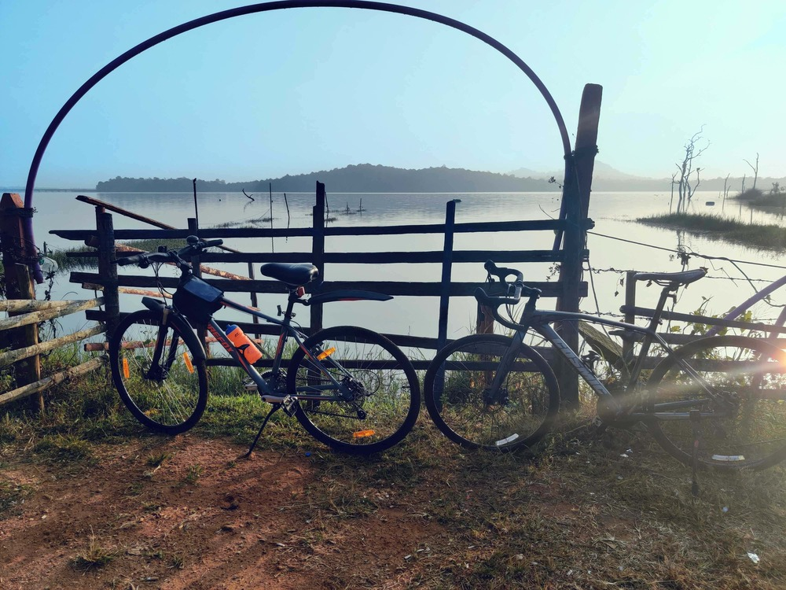
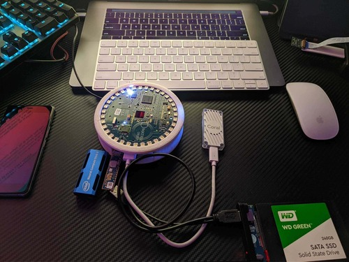
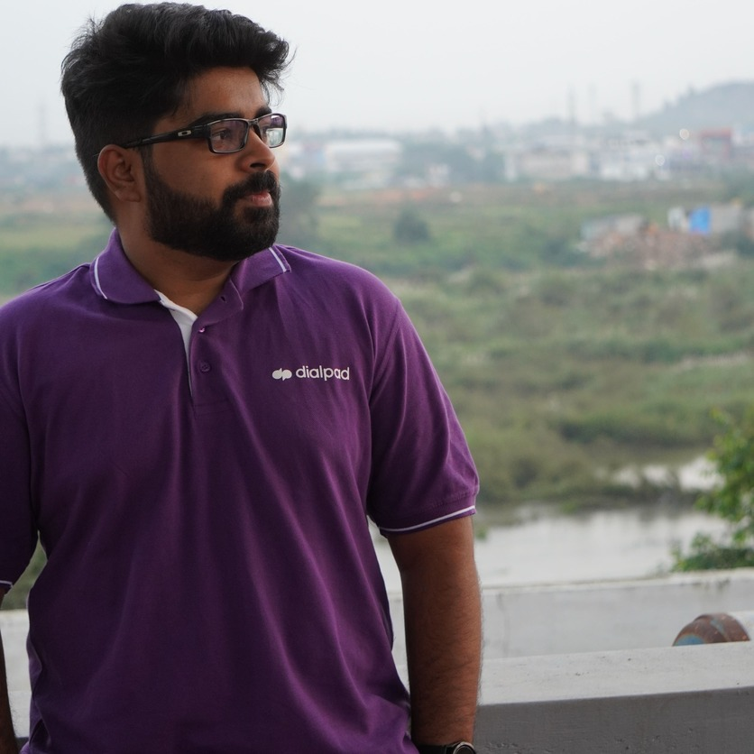

# Home

Hello there!

I'm Shreekantha (Shree). I'm currently a Speech Recognition Engineer at [Dialpad](https://www.dialpad.com/), building the next-gen ASR product. Before this, I was pursuing MS by Research in Data Science at [IIIT-Bangalore](https://www.iiitb.ac.in/) under the supervision of [Prof. Sachit Rao](https://www.iiitb.ac.in/faculty/sachit-rao) and [Prof. V. Ramasubramanian](https://www.iiitb.ac.in/faculty/v-ramasubramanian), where I also worked at the [E-Health Research Center (EHRC)](https://ehrc.iiitb.ac.in/) and the [Machine Intelligence and Robotics Center (MINRO)](https://minro.org/) as a Research Scholar. I graduated with a thesis on ["Multi-task learning in end-to-end attention-based automatic speech recognition"](https://drive.google.com/file/d/1KAS1Hm0-9ZcAxc7h3YIIKxAz9lbgBD5i/view?usp=sharing). Before joining IIIT-Bangalore, I was with Sonus Networks (Now [Ribbon Communications](https://ribboncommunications.com/)) where we developed [Element Management Systems](https://ribboncommunications.com/company/get-help/glossary/element-management-system-ems) for 4G-VOIP products. I have a B.E. in Telecommunication Engineering from [JNNCE Shivamogga (VTU)](https://jnnce.ac.in/).

**My research interests include:**

- Streaming end-to-end ASR for conversational, telephony, and videoconferencing speech
- Low-latency and computationally constrained scenarios
- Multi-lingual and code-switched speech recognition
- Bringing external knowledge into the purely data-driven end-to-end architectures

---

When I'm not building next-gen ASR products, I conduct research to bring in some classical speech knowledge to the purely data-driven models of recent years. Through this exercise, I'm hoping to blend the pure data-driven architectures with speech knowledge, leading to a reduction in model complexity, faster training/inference, and hopefully, deeper insights into speech recognition. 

Other problems I am currently working on include 
- KWS using neural attention
- A pre-training method for end-to-end ASR
- Better training strategies for encoder-attention-decoder models
- Interpretability and explainability of end-to-end ASR models
- Multilingual and code-switching scenarios
- Gathering data and building ASR models for low-resource Indian Languages
  - Kannada
  - Sanskrit

Most of my work is in kaldi/K2, ESPnet, NeMo, and some custom code in PyTorch ❤️ and TensorFlow 2^.

---

**When I'm not working on Speech and Language Technology:**

- I love to go cycling

    

- Build stuff that interests me

    

- Contemplate upon the nature of existence and consciousness. Talk to me about it from all perspectives - materialistic, advaitic, dvaitic, etc. "अथातो ब्रह्म जिज्ञासा" (Athāto brahma jijñāsā - **Now** is the time to inquire about the Absolute Truth).

**This is me in 2022:**

    

You can reach me at [shreekantha.nadig@iiitb.ac.in](mailto:shreekantha.nadig@iiitb.ac.in)
